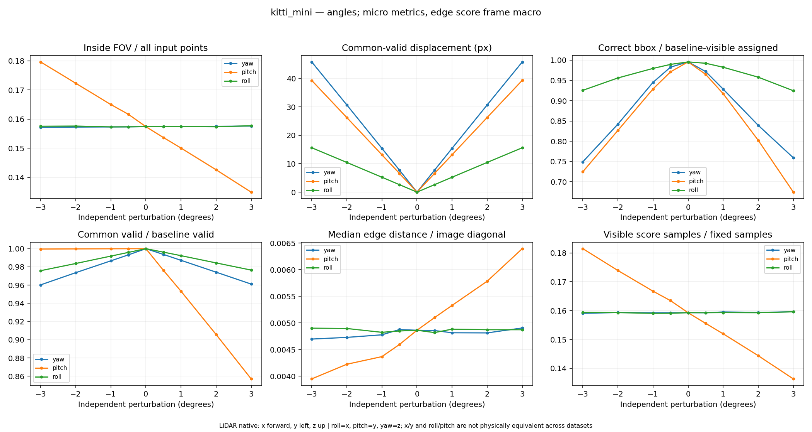
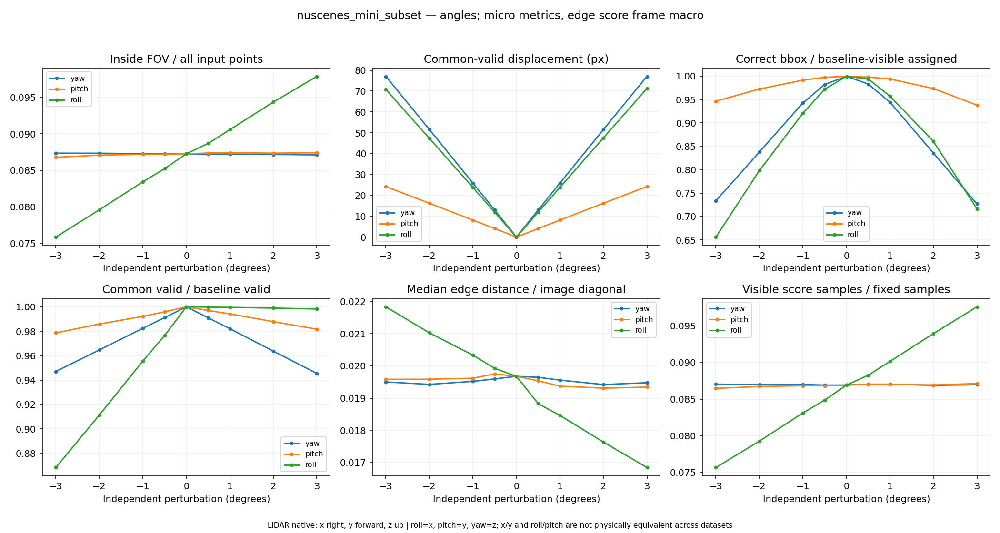
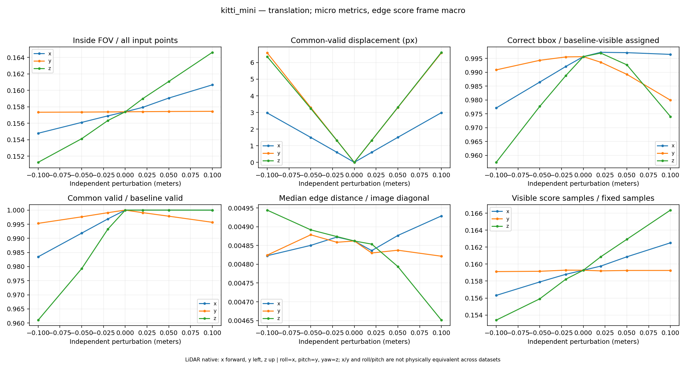
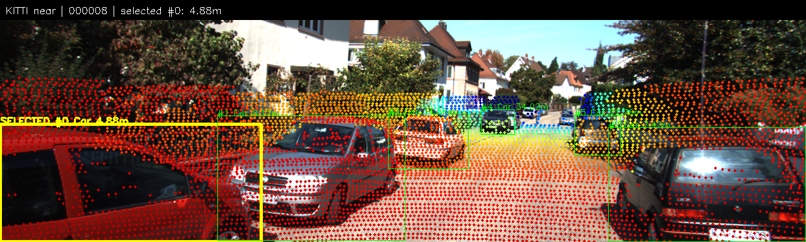
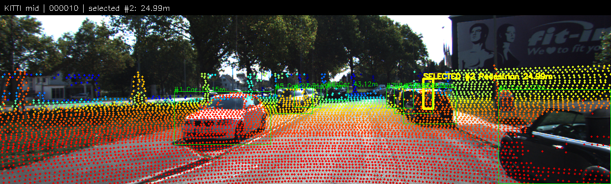
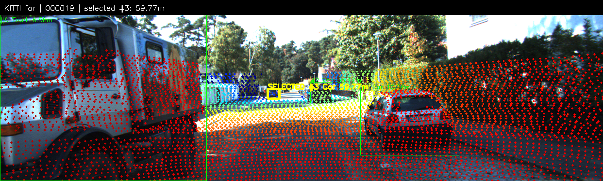
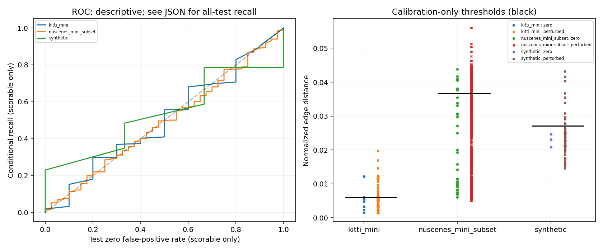
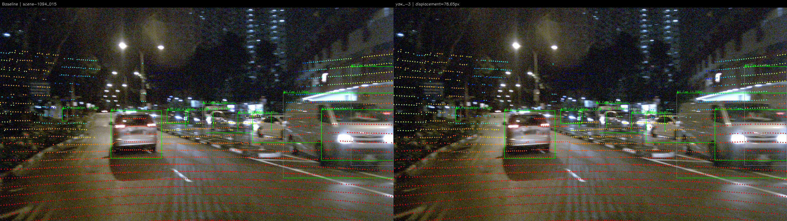

# Báo cáo Day 6: Độ nhạy calibration LiDAR–camera và giới hạn score Canny

- **Họ tên:** Đoàn Quang Thắng
- **MSSV:** 2A202602395
- **Lớp:** H210 — VinUni AI20K — Track 4: Computer Vision and Robotics
- **Link repo:** https://github.com/conanWinner/DoanQuangThang-2A202602395-Track4-Day21
- **Topic:** A — LiDAR-camera projection QA
- **Dataset:** `data/kitti_mini`, `data/nuscenes_mini_subset`, `data/synthetic`.
- **Các frame đã dùng:** toàn bộ 20 KITTI, 80 nuScenes (`scene-0103_000`…`039`, `scene-1094_000`…`039`) và 5 synthetic (`000000`…`000004`). Danh sách chính xác trong [config.json](../results/topic_a_local_20261008/config.json).

## 1. Claim

Trong tập mini này, lệch yaw +1° làm điểm chiếu dịch trung bình **15,42 pixel trên KITTI** và **25,88 pixel trên nuScenes**, mặc dù tỷ lệ điểm nằm trong ảnh gần như không đổi.
Tỷ lệ điểm còn đúng box giảm lần lượt từ **99,56% xuống 92,85%** và **99,94% xuống 94,43%**.
Vì vậy chỉ đếm điểm trong ảnh không đủ để kiểm tra calibration. Score khoảng cách tới biên Canny cũng chưa đủ tin cậy để làm cảnh báo duy nhất.
Đây là thí nghiệm độ nhạy với sai lệch được tạo có kiểm soát; chưa chứng minh khả năng phát hiện sai lệch trên xe thật hay scene mới.

## 2. Evidence

Chạy CPU ngày 08/10/2026, seed 2026: **105 frame × 43 cấu hình = 4.515 dòng duy nhất**, cùng 56.674 dòng object–configuration.
Thay đổi riêng yaw/pitch/roll ở ±0,5/1/2/3° và dịch x/y/z ở ±2/5/10 cm, dùng một baseline chung. Mọi factor và giá trị có trong `config.json`.
Số liệu gốc: [summary.csv](../results/topic_a_local_20261008/summary.csv), [per_frame_config.csv](../results/topic_a_local_20261008/per_frame_config.csv); các shard object được liệt kê trong [csv_manifest.json](../results/topic_a_local_20261008/csv_manifest.json).

| Dataset | Yaw | Trong ảnh (%) | Độ lệch trung bình (pixel) | Đúng box (%) | Coverage (%) |
|---|---:|---:|---:|---:|---:|
| KITTI | 0° | 15,740 | 0,00 | 99,56 | 100,00 |
| KITTI | +1° | 15,750 | 15,42 | 92,85 | 98,72 |
| KITTI | +2° | 15,751 | 30,70 | 83,92 | 97,42 |
| KITTI | +3° | 15,760 | 45,82 | 75,92 | 96,12 |
| nuScenes | 0° | 8,727 | 0,00 | 99,94 | 100,00 |
| nuScenes | +1° | 8,723 | 25,88 | 94,43 | 98,21 |
| nuScenes | +2° | 8,718 | 51,55 | 83,54 | 96,36 |
| nuScenes | +3° | 8,712 | 77,05 | 72,69 | 94,54 |
| Synthetic | 0° | 15,361 | 0,00 | 99,68 | 100,00 |
| Synthetic | +1° | 15,478 | 15,00 | 90,98 | 99,27 |
| Synthetic | +2° | 15,584 | 29,89 | 79,81 | 98,57 |
| Synthetic | +3° | 15,737 | 44,72 | 67,84 | 97,98 |

Trong ảnh = điểm hợp lệ trong FOV / toàn bộ điểm đầu vào. Độ lệch là trung bình trên điểm nhìn thấy ở cả baseline và cấu hình lệch; đọc kèm coverage = điểm nhìn thấy ở cả hai / điểm nhìn thấy baseline.
Đúng box dùng nhóm điểm cố định nằm trong box 3D và nhìn thấy ở baseline; chỉ xét object có ≥5 điểm, điểm trôi ra ngoài ảnh vẫn tính sai. Các tỷ lệ trong bảng gộp tử số/mẫu số toàn dataset (micro), không trung bình tỷ lệ từng frame.
Box 2D nuScenes được sinh từ nhãn 3D, không phải nhãn kiểm chứng độc lập; chuyển box nghiêng sang KITTI upright là xấp xỉ. Trục x/y và roll/pitch của hai dataset khác quy ước, không so sánh như cùng hướng vật lý.
Ví dụ frame đầu: KITTI `000001` có ảnh 1242×375 và fx=721,54 pixel; nuScenes `scene-0103_000` có ảnh 1600×900 và fx=1252,81 pixel. Theo phép chiếu pinhole, cùng thay đổi hướng nhỏ thường gây dịch pixel lớn hơn khi tiêu cự theo pixel lớn hơn; đây là một yếu tố hợp lý giải thích khác biệt, chưa phải thí nghiệm tách riêng nguyên nhân. Cảnh ngày/đêm, mật độ điểm, nhãn và phân bố khoảng cách cũng khác nhau.





Ba ảnh demo chọn object gần 5/25/60 m trên ba frame KITTI khác nhau; khoảng cách thực tế là chuẩn Euclid của tâm đáy box trong camera rectified, không phải khoảng cách của mọi điểm trong ảnh. Object chọn được tô box vàng, xem [overlay_manifest.json](../results/topic_a_local_20261008/overlay_manifest.json).





Score thử nghiệm là trung vị khoảng cách từ điểm chiếu tới biên Canny 100/200, chuẩn hóa theo đường chéo ảnh; thấp hơn là tốt hơn. Chọn tối đa 4.096 point ID hữu hạn cố định mỗi frame trước projection, yêu cầu ≥30 mẫu nhìn thấy.
Ngưỡng là phân vị 95% của score baseline trên nhóm calibration; nhóm test không chỉnh ngưỡng. Chia frame xác định theo seed trong từng dataset/scene, nên frame lân cận còn tương quan.

| Dataset | Ngưỡng | Test drift phát hiện / tổng | Tỷ lệ phát hiện | Báo nhầm baseline test | Không đủ score |
|---|---:|---:|---:|---:|---:|
| KITTI | 0,005953 | 126 / 420 | 30,00% | 3 / 10 (30,00%) | 0% |
| nuScenes | 0,036728 | 222 / 1.680 | 13,21% | 6 / 40 (15,00%) | 0% |
| Synthetic | 0,027143 | 12 / 126 | 9,52% | 0 / 3 (0%) | 0% |

Nguồn: [score_evaluation.json](../results/topic_a_local_20261008/score_evaluation.json). Tỷ lệ phát hiện tính trên **mọi** test drift, gồm trường hợp không đủ score nếu có; ở lần này tỷ lệ có điều kiện bằng tỷ lệ tổng vì tất cả đủ score.


Latency chỉ đo hai hàm projection, đầu vào đã nạp sẵn, 5 warmup + 30 lần trên một frame/dataset: KITTI `000001` p50/p95 = **11,39/12,31 ms**, nuScenes `scene-0103_000` = **1,87/2,03 ms**.
Máy Intel i5-11400H, OpenCV một thread; không gồm I/O, vẽ ảnh, metric, không đại diện toàn dataset hay phần cứng xe. Phiên bản thư viện, hash code và dữ liệu nằm trong [environment.json](../results/topic_a_local_20261008/environment.json), [data_manifest.json](../results/topic_a_local_20261008/data_manifest.json).

## 3. Failure case

Frame ban đêm **nuScenes `scene-1094_015`**, gây lệch **yaw −3°**: điểm chiếu dịch trung bình **78,65 pixel**, p95 **91,97 pixel**, chỉ **72,44%** điểm baseline-assigned còn đúng box.
Tỷ lệ trong ảnh chỉ thay đổi **−0,026 điểm phần trăm**; coverage còn **93,38%**. Score **0,014708 ≤ ngưỡng 0,036728**, nên **không báo drift**, dù 351/4.096 mẫu nhìn thấy vẫn đủ điều kiện tính score.
Chọn tự động trường hợp test drift bị bỏ sót có độ lệch trung bình lớn nhất, không chọn ngưỡng lại sau khi xem test. Dữ kiện đầy đủ: [fail_01_facts.json](../results/topic_a_local_20261008/fail_01_facts.json).
Đây là lỗi ở lớp **Metric** khi đánh giá lỗi **Geometry**: Canny đo gần biên ảnh bất kỳ, không yêu cầu biên đó đúng vật thể; trung vị còn phụ thuộc nhóm điểm nhìn thấy. Ảnh tối/nhiễu là bối cảnh quan sát, chưa tách thí nghiệm để kết luận là nguyên nhân duy nhất.
Camera lệch timestamp LiDAR −35,995 ms; loader bù ego motion nhưng không bù chuyển động object. Yếu tố Time có thể ảnh hưởng baseline, không giải thích riêng tác động yaw vì ảnh/điểm/timestamp được giữ cố định trong sweep.



## 4. Khuyến nghị nếu triển khai thật

Với ADAS, theo dõi đồng thời tỷ lệ điểm trong ảnh, coverage, score, timestamp và chất lượng ảnh; dùng ngưỡng cần được kiểm chứng theo điều kiện sáng/tối, không dùng score Canny này làm cảnh báo an toàn duy nhất.
Trong vận hành không có calibration chuẩn để tính độ lệch UV tham chiếu và không luôn có nhãn box 3D; hai metric này hiện là công cụ benchmark, không mặc nhiên là tín hiệu online.
Bước tiếp theo: ghép biên độ sâu với biên ảnh theo vật thể, kiểm tra chuỗi thời gian, holdout toàn scene độc lập và thử lệch calibration thật; báo cáo cả bỏ sót, báo nhầm và trường hợp không đủ score.
Đổi thuật toán lấy độ tin cậy cần thêm xử lý, vì vậy phải đo lại độ trễ của toàn pipeline trên phần cứng đích. Các kết quả hiện tại chưa kiểm chứng scene mới; nuScenes box 2D sinh từ 3D còn tạo phụ thuộc nhãn.

## 5. Cách chạy lại

Từ gốc repo có toàn bộ code và dữ liệu, dùng Python ≥3.10. Tạo môi trường riêng; chọn đường dẫn output **mới** cho mỗi lần chạy, script từ chối ghi đè kết quả cũ.

```bash
python -m venv .venv
.venv/bin/python -m pip install -r src/requirements-kaggle.txt
.venv/bin/python -B tools/verify_data.py --data-root data/kitti_mini
.venv/bin/python -B tools/verify_data.py --data-root data/nuscenes_mini_subset
.venv/bin/python -B -m unittest discover -s src/tests -v
OPENBLAS_NUM_THREADS=1 OMP_NUM_THREADS=1 MKL_NUM_THREADS=1 .venv/bin/python -B -m src.calibration_benchmark --out-dir results/topic_a_reproduction_01 --seed 2026 --latency-repeats 30
.venv/bin/python -B tools/check_submission.py
```

Đã chạy thực tế ở địa phương bằng môi trường riêng `/tmp/day21-completion-env-20261008`: dữ liệu PASS, **13/13 test PASS**, benchmark `completion.status=complete`; xác minh đủ 20/80/5 frame và 43 cấu hình mỗi frame, không trùng khóa.
Đã clone mới từ GitHub vào `/tmp/day21-audit-20261008-clean` và chạy lại benchmark đầy đủ vào output mới: `summary.csv`, bảng frame/object, `score_test.csv` khớp trong sai số `rtol=1e-7, atol=1e-10`; đánh giá score và dữ kiện failure khớp chính xác. Đủ 21 đường dẫn nội bộ trong bản báo cáo lúc audit, không sửa dữ liệu gốc.
CP0 synthetic đã chạy và lưu [data_health.csv](../results/data_health.csv) đủ 5 frame. [Tài liệu CP6](PRESENTATION_CP6.md) gồm bài nói 3 phút, ảnh cần mở và câu trả lời vấn đáp; đây là tài liệu chuẩn bị, không chứng nhận đã trình bày hoặc tự tập nói.
[Slide PDF CP6](../output/pdf/day21_topic_a_presentation.pdf) có 4 trang, tạo từ bảng và ảnh kết quả thật; đã render kiểm tra đủ 4 trang. Tạo lại bằng `python -m pip install reportlab==5.0.1`, rồi `python -B src/build_presentation_pdf.py --out output/pdf/day21_topic_a_presentation_new.pdf`; Linux cần font DejaVu tại `/usr/share/fonts/truetype/dejavu`, hoặc truyền `--font-dir` tương ứng.
Notebook [src/topic_a_kaggle.ipynb](../src/topic_a_kaggle.ipynb) đóng gói code địa phương và tests, xác minh SHA-256, lấy dữ liệu Git revision cố định `bce73adec3dbd09b2869ed2061513328ee228272`, không cần tạo Kaggle dataset.
Notebook CPU, Internet bật, riêng tư: [Track4 Day21 Lidar Camera Calibration](https://www.kaggle.com/code/thngonquang/track4-day21-lidar-camera-calibration), **phiên bản 1 COMPLETE**. [Log Kaggle](../results/kaggle_v1_20261008/track4-day21-lidar-camera-calibration.log) xác nhận **13 test OK**; artifact remote có đủ **4.515 dòng**, 20/80/5 frame và 43 cấu hình mỗi frame, cùng **56.674 dòng object–configuration**.
Đã tải kết quả về [thư mục Kaggle v1](../results/kaggle_v1_20261008/results/topic_a_20261008T001923Z_fc959e59/completion.json): hash nguồn trùng bản địa phương, 276 hash file dữ liệu khớp, hash CSV khớp manifest; toàn bộ `summary.csv` remote khớp local trong sai số `rtol=1e-7, atol=1e-10`. Xem [verification.json](../results/kaggle_v1_20261008/verification.json).
Bảng và latency bên trên là **lần chạy địa phương**. Latency Kaggle đo riêng: KITTI p50/p95 **38,10/39,37 ms**, nuScenes **3,87/4,12 ms**; không so sánh như cùng phần cứng hoặc cùng cấu hình thread.
Muốn tạo notebook cho nguồn code mới, chạy `python -B src/build_kaggle_notebook.py --out src/topic_a_kaggle_new.ipynb` rồi trỏ metadata tới file mới; builder từ chối ghi đè notebook có sẵn.

## 6. Khai báo sử dụng AI

| Công cụ | Dùng cho việc gì | Cách kiểm chứng đã thực hiện |
|---|---|---|
| OpenAI Codex | Rà soát code Topic A hiện có, chuẩn bị môi trường, chạy thí nghiệm, đóng gói/push notebook Kaggle, tổng hợp báo cáo, bài nói và slide PDF từ artifact thật | Agent chạy 13 test gồm điểm synthetic đã biết, NaN/Inf/depth/FOV, phép biến đổi, mẫu số recall và shard CSV; kiểm tra dữ liệu, cardinality, JSON/hash; mở ảnh overlay, biểu đồ và failure thực tế; render và kiểm tra 4 trang PDF |

Các thao tác kiểm chứng trên do agent thực hiện trong phiên làm việc; không khẳng định học viên đã tự kiểm chứng hoặc đã trình bày. Học viên cần đọc hiểu hai hàm projection, mẫu số metric và failure trước khi vấn đáp.
Không train model; không tạo số liệu hoặc ảnh giả. Không thay đổi dữ liệu gốc. Repo gốc đề bài: https://github.com/VinUni-AI20k/K4-Track4-Day06-3D-From-Point-Clouds; nguồn dữ liệu và quy ước xem `data/README.md`, `starter/kitti_io.py`, `starter/nuscenes_io.py`.
